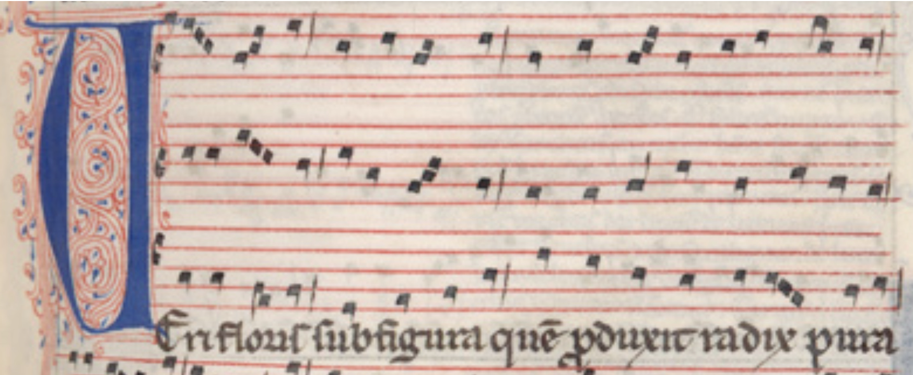
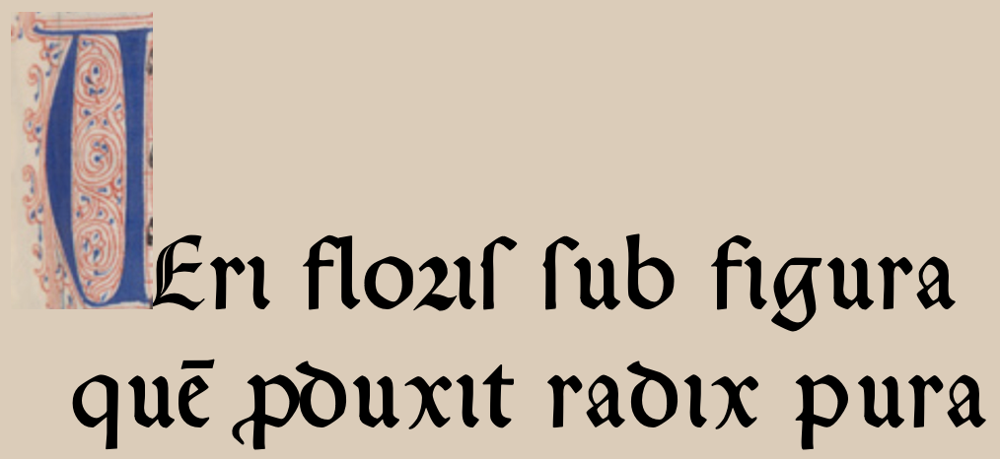
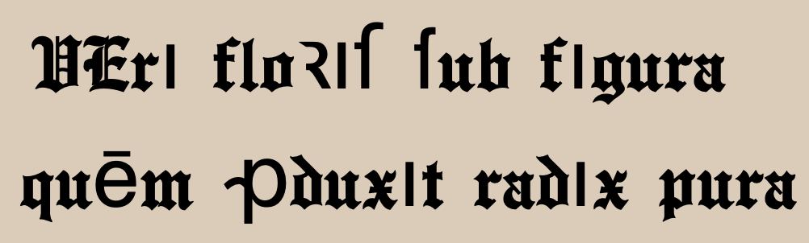
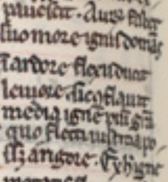
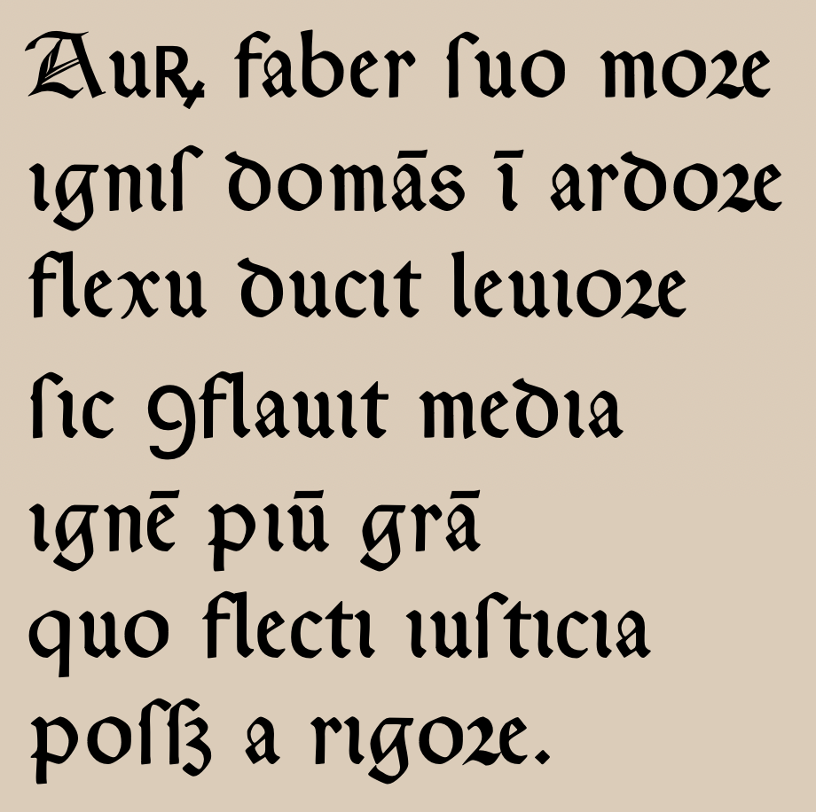

# Paleography

This repository defines a minimalistic encoding specification for Latin Medieval and (early) Modern text spelling practices in musical sources.




> Beginning of conductus _Veri Floris_ from MS I-Fl Pluteus 29.1, f. 229r (a.k.a. Magnus Liber Organi).

The lyrics encoded with _Paleography_ looks like this:

```
\dropcap Veri floris* s*ub figura
que*m pr*oduxit radix pura
```

The proposed encoding:
* is reducable to the "modern"  Latin spelling convention,
* uses only a small set of metacharacters / keywords,
* is tailored to spelling practices most commonly found in various eras, but does not disallow less common spelling variants.

The goal is to provide a fast way for an editor to capture the relevant graphical and semantic features of a script's spelling without adhering to general-purpose  standards (like TEI).

Primarily developed for music editors, this encoding can be adopted within other fields where capturing of older spelling variants is desired.

> [!IMPORTANT]
> The prototype of the _Paleography_ specification was originally developed for a LilyPond macra library _Early_, facilitating working with music manuscripts and early prints. Thus, it primarily targets early music editors, who need a quick and efficient way of encoding graphemical variations of Latin sources between XIII and XVII centuries. Because the specification became it's own thing, we hope it's features can be extended to any period and maybe even language in the future.

## Rationale

When working with Latin documents, it often suffices to provide a (non-specialist) reader with a text rendering, whose spelling uses modernized spelling conventions:

```
Veri floris sub figura
quem produxit radix pura...
```
There are however situations where an editor of such a document might desire to retain some (or all) of the source's original spelling conventions in a digital edition.  

At once, many frictions happen to surface between various textual aspects (semantics, glyphs) and technological choices (character encoding limitations or practicalities, manual typing of verbose instructions).

The most common approaches tend to have clear downsides.

1) **Dedicated paleographic fonts** (like those by [Juan José Marcos's](https://www.typofonts.com/palefont.html)) contain desired glyphs...

    
  
    ...but are difficult to manually type because they replace arbitrary or non-standard unicode characters:
  
    ```
    VErı floı$ $ub fıgura
    qu duxıt radıx pura 
    ```

2) Modern **Unicode** glyphs (e.g. from _Latin Extended-D_ with _combining diactrics_) or other paleography-tailored standards (like [MUFI](https://www.mufi.info/q.php?p=mufi)) point to correct glyphs...
    ```
    VErı floꝛıſ ſub fıgura
    quēm ꝓduxıt radıx pura
    ```
    ... but those glyphs are not guaranteed to be covered by all fonts.
  
    


3) **TEI** encoding is a standard tool for this kind of task, tailored for creating semantically-rich digital hypertext editions, exceling in capturing both text's semantics and rendering instructions.

    ```xml
    <!--
    One of many ways to encode it:
    -->
    <hi rend="dropcap blue">V</hi>
    <c rend="majuscule">e</c>ri
    flori<choice><orig>ſ</orig><reg>s</reg></choice>
    <space/>
    <choice><orig>ſ</orig><reg>s</reg></choice>ub figura
    <space/>
    qu<choice>
      <abbr rend="supraline"><am>e</am></abbr>
      <expan><ex>em</ex></expan>
    </choice>
    <choice>
      <abbr><am>ꝓ</am></abbr>
      <expan><ex>pro</ex></expan>
    </choice>duxit radix pura
    <!-- 
    (Note that I ignored to encode the 'dotless' `i`...)
    -->
    ```
    However, TEI is a general-purpose tool requiring high level of expertise, verbosity and rendering tool compliance. Its main fallacy lies in allowing multiple ways of expressing similar content, leading to plethora of coexisting standards and risking reduced software interoperability (among other issues typical for XML tooling).

4) **Platform-specific tools** might be the most suitable for this task (for example LaTeX's [yfonts](https://www.latex.org.uk/fonts/yfonts-otf/doc/yfonts-otf.pdf)), but platform-dependency hinders interoperability of the source files, tying their execusion to a given rendering engine.

## _Paleography_

The focus of this (small) specification is to provide an easy-to-learn, quick and interoperable way of encoding Latin texts that can be implemented on any displaying platform.

A big merit of _Paleography_ is that it separates spelling _directives_ from the desired rendering of the font glyphs. The editor marks which spelling option is used. A separate routine should take care of supplying the correct glyphs from a font.

This specifications is meant as a proxy encoding allowing generation of e.g. TEI, font- and platform-specific encodings etc.

## Example text

Let's demonstrate this with how we may encode the third stanza of _Veri Floris_ conductus in a `.paleo` textfile using _Paleography_ (with the expected unicode rendering):



We will prepare our preamble to let know the client how to render the text using pure unicode glyphs. We will encode it using preset `medieval`. A preset is a set of rules that govern our text rendering. They come together with the specification, so you don't have to explicitly type all the rules yourself.

```yaml
# conductus.paleo
---
rules:
  preset: medieval
---
```

This preset contains rules like:
```yaml
# Medieval preset rules:
i-dotless: always # picks glyph that represents i without a dot.
s-long: auto # pick glyph representing `ſ` if it is not the last letter of the word.
r-round: auto  # pick `r rotunda` glyph after a "round" letter (`b`, `p`, `h`, `o`, etc).
v-as-u: always # swap all `v` to `u`.
j-as-i: always # swap all `j` to `i`.
-rum-round: auto # same as `r-round` but for final "rum" ligature.
ti-as-ci: auto # swap all `ti` followed by vowel to `ci`.
# ... etc ...
```

Based on our reading of the fragment, we need to provide a few modifications to the default settings:
1) because our scribe uses long `ſ` at the end of the words, we will override the "`s-long`" rule to "`always`".
2) we will make sure that for our `unicode` transcription uses `ꝯ` for the initial `con-` (the default is antisigma `ↄ`).

```yaml
# conductus.paleo
---
rules:
  preset: medieval
  s-long: always
unicode:
  -rum: ꝶ
  con-: ꝯ
---
```

Now, we will transcribe our text to a modern standard Latin spelling. But... we will immediately use _Paleography_'s special tokens to denote all the spelling variants. We will use asterisk (`*`) to mark common ligatures (e.g. `-rum` in "_Aurum_") and exceptions to the rules (e.g. final `-s` in "_domans_"). We will also use angle brackets `< >` to express contractions (like in "_gratia_").

```yaml
# conductus.paleo
---
rules:
  preset: medieval
  s-long: always
unicode:
  con-: ꝯ
---
Aur*um faber suo more
ignis doma*ns* i*n ardore
flexu ducit leviore
sic c*onflavit media
igne*m piu*m gra<tia>
quo fleti justitia
posse*t a rigore.
```

The result in our renderer should look like:

```unicode
Auꝶ faber ſuo moꝛe
ıgnıſ domās ī ardoꝛe
flexu ducıt leuıoꝛe
ſıc ꝯflauıt medıa
ıgnē pıū grā
quo flectı ıuſtıcıa
poſſꝫ a rıgoꝛe.
```

We could use a chosen font (e.g. Marcos' `Gothica Rotunda`) and assign the it's corresponding glyphs to the rules:


```yaml
---
rules:
  preset: medieval
  s-long: always
unicode:
  con-: ꝯ
font:
  Gothica Rotunda: # use name familiar to how your system recognizes this font.
    s-long: $
    abbreviation:  # Font's combined character.
    -et: 
    r-round: 
    nasals: # This font has dedicated vowel glyphs for contracted nasals, let's use them.
      a: 
      e: 
      i: 
      o: 
      u: 
---
Aur*um faber suo more
ignis doma*ns* i*n ardore
flexu ducit leviore
sic c*onflavit media
igne*m piu*m gra<tia>
quo flecti justitia
posse*t a rigore.
```

This should result in picking the following characters:
```
Auꝶ faber $uo moe
ıgnı$ doms  ardoe
flexu ducıt leuıoe
$ıc ↄflauıt medıa
ıgn pı gra
quo flectı ıu$tıcıa
po$$ a rıgoe.
```



**But alas!** It seems that we did not specified the glyphs for `-rum` and `con-` ligatures and the default unicode was used instead. This is because the font lacks those glyphs entirely (as for now..!).

In such case it is up to the editor how to solve this issue:
* remove rules for unsupported ligatures:
  ```yaml
  rules:
    -rum: never
    con-: never
  ```
  
  > [!CAUTION]
  > This is not recommended as it affects the `.paleo` file globaly.

* use different but available glyphs:
  ```yaml
  font:
    Gothica Rotunda:
      -rum:  # using "rotunda" analog: `ꝝ`.
      con-:  # using "antisigma" analog: ↄ.
  ```
  > [!IMPORTANT]
  > Even though the **wrong** glyphs are displayed, the paleographical information is not affected. We can still safely export our original `.paleo` file to different format and its semantics will be correct.

The font does not have glyphs for `ꝶ` and `ↄ`, so the default unicode was used. 

# Syntax

_Paleography_ specification is made of two complementary elements: _directives_ (_rules_, _font_ and _unicode_ rendering) and _tokens_ (metacharacters inserted to the Latin text).


### `.paleo` files

You can provide both rules and transcriptions inside the same text file, using the suggested `.paleo` extension. Such a file can contain a `YAML` preamble with all the specified directives.

```yaml
---
# Preamble
rules: # ...
unicode: #...
font: #...
---
Pedicabo ego vos et irrumabo,
Aureli pathice et cinaede Furi...
```

This format of the `.paleo` file is only a proposed convention on how to tie the rules and font rendering together – your system implementing _Paleography_ specification can use different solution, but still adhere to the _rule_ labels and syntax (for example plain text files and `JSON` file for rules).

Note however that it is a **good practice** to store the _directives_ directly by the encoded texts. If rules value change, so the interpretaion of _tokens_ change and the graphological information is affected.

### Rules

A _rule_ is a directive that tells your renderer to automatically swap certain glyph (or glyphs) for another ones (specified in _unicode_ or _font_ directives). The default rules follow closely the _most common spelling practices_ of Latin before XVIII century and are meant to speed up the transcription process.

> [!TIP]
> Example of most common practices include:
> * using _long s_ (`ſ`) in the middle of the words,
> * not distinguishing `v` and `u`,
> * using _r rotunda_ (`ꝛ`) before "round" graphemes like `b` or `o`.

Rules specified in the `.paleo` file preamble apply to this entire file. You can specify the preset containg many rules, overwrite them, or simply enter your own values.

```yaml
---
rules:
  preset: medieval
  nasals: always # Contract all nasals after vowels everywhere.
---
```

Rules usually take the following values:
* `always` -- apply this rule without explicit mention
* `auto` -- follow most typical convention
* `indicated` -- apply the rule only if explicitly indicated.

Each rule capture one and only one idiom of Latin spelling. Rules can contradict each other; if two incompatible rules are specified, the last one mentioned takes precedence.

_To do: more about rules._

### Font

The `font` directive provides a map tying rule execution to picking the correct characters that is the closes to witness' glyph.

In your preamble you can define mappings for several fonts. The name of the font must be identical to the name your system recognizes it:

```yaml
font:
  Gothica Rotunda:
    # ...
  Gothica Textura Precissa:
    # ...
  English Towne:
    # ...
  IM FELL DW Pica:
    # ...
  Arial:
    # ...
```

> [!NOTE]
> In the future, the specification will provide a way to store those font mappings in separate files, so the editor can import them and further override them. The specification will "come out of the box" with default mappings for relevant fonts.
>```yaml
> ---
> font:
>   # Config for e.g. "Gothica Rotunda" will be 
>   # included together with Paleography and its
>   # file does not have to be imported.
>   import:
>     - "./My English Towne settings.paleofont" # My own config
>   Gothica Rotunda:
>     # Overriding default config...
>   English Towne:
>     # Overriding default config
>     # from the imported file...
> ---
>```


#### Unicode

Unicode is a special mapping that takes into account glyphs presented in _Latin Extended-D_ block. If a glyph mapping is not defined for a font, it defaults to the unicode mapping.

Usually you do not need to define this mapping, as this specification does it for you.

> [!NOTE]
> MUFI (Medieval Unicode Font Initiative) is definitely not to be ignored by this project and their docs are always checked by the author of this repo.
>
> Althoug MUFI is very much tied to the Unicode, it is still it's own thing and it is not yet decided how it will be incorporated with this spec. An idea is to have a separate directive working simirarly to `unicode`:
> ```yaml
> ---
> mufi: #...
> ---


### Tokens

_Tokens_ signalise that spelling needs to be modified according to _rules_ (set by user or coming from _Paleography_'s default preset).

| name | token | example | expected result<br>(unicode, default rules) |
|:---:|:---:|---|---|
| change | `*` | `u*m`, `or*um`,<br>`pr*o`, `p*er`,<br>`-u*s`, `us*`,<br>`et*`, `et**`,<br>`C*hristo` | `ū`, `oꝝ`,<br>`ꝓ`, `ꝑ`,<br>`-ꝰ`, `uſ`,<br>`&`, `⁊`,<br>`xp̄o` |
| abbreviate | `< >` | `q<ui>`, `n<on>` | `q̄`, `n̄`,   |
| ommit | `[]` | `[s]ae[c]u[l]o[r]u[m ]a[m]e[n]` | `euouae` |
| expand | `!` | `deo g[ratias]!`<br> `v<irginis>!` | `deo gratias`<br>`virginis` |
| macro |  `\` | \dropcap Initial | _("I" renders elsewhere)_<br>`Nitial` |

**Asterisk** (`*`) marks a spelling change that either require explicit marking or is an exception to the _rules_ setup in the preamble.

* _ligature_ rules most often require them to be marked explicitly
* _exceptions_ revert the rule's effect.

**Abbreviate**

**Ommit**

**Expand** with `ommit`, `abbreviate` and `asterisk`

** macra **


# Future work

- [ ] More love towards layout options in `.paleo` preamble: biting, kissing, treatment of feet :)
- [ ] More available glyphs preset for common fonts (Marcos, open-source etc)
- [ ] Clearer demarkation of vowel abbreviations (like `qͥ`, `nͤ`).
- [ ] More formal description of grammar
- [ ] Provide regex formulas for the rules.
- [ ] Allow YAML preamble to "include" external files with such preambles.
- [ ] Create "hooks"/workarounds for unsupported glyphs
